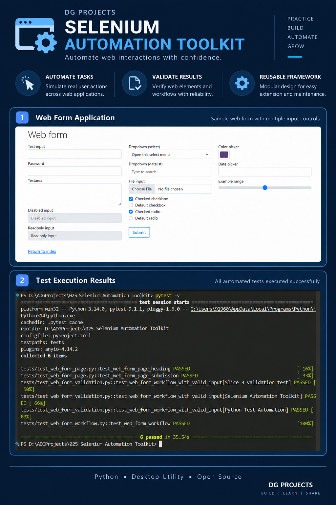
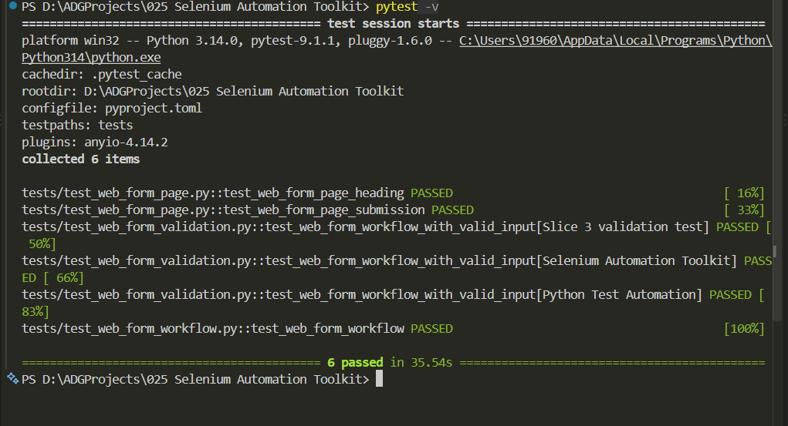
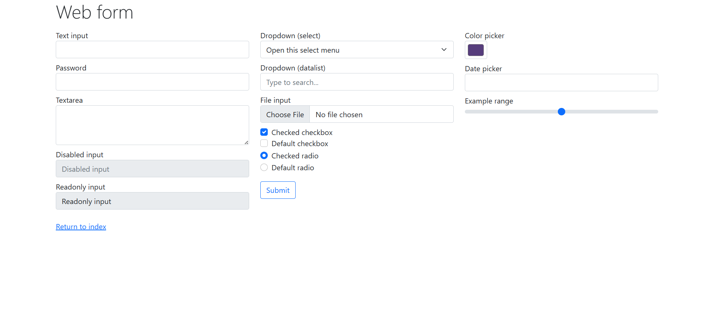

# 2. Project Badges


# 3. Screenshots

### Test Results



### Failure Diagnostics



# 4. Project Title

# Selenium Automation Toolkit

**Project ID:** 025

# 5. Project Overview

Selenium Automation Toolkit is a Python-based browser automation project demonstrating a layered approach to Selenium WebDriver automation.

The project automates the Selenium Web Form, validates page and workflow behavior, uses explicit waits for synchronization, and provides failure diagnostics through automatic screenshot capture during pytest failures.

### Purpose

- Demonstrate reusable Selenium automation architecture.
- Separate browser management, automation operations, page objects, workflows, synchronization, and testing.
- Provide a maintainable foundation for browser-based automation.

### Problem Solved

The project avoids concentrating Selenium operations directly inside individual tests. Browser lifecycle management, reusable browser actions, page-specific interactions, workflow orchestration, synchronization, and diagnostics are separated into dedicated components.

### Typical Use Cases

- Web UI automation
- Regression testing
- Form automation
- Page Object Model demonstrations
- Selenium test framework development
- Failure investigation using browser screenshots

# 6. Features

- Chrome WebDriver automation
- Web Form navigation and submission
- Page Object Model implementation
- Reusable browser automation operations
- Explicit Selenium waits
- Workflow-based test execution
- Parameterized validation testing
- Pytest regression testing
- Failure screenshot capture
- Centralized browser configuration
- Execution logging
- Structured project organization

# 7. Technology Stack

| **Technology** | **Usage** |
| --------------- | --------- |
| Python 3.14 | Application and automation implementation |
| Selenium WebDriver | Browser automation |
| Chrome | Automated browser |
| Pytest | Automated testing and regression execution |
| pathlib | Project path and filesystem configuration |
| dataclasses | Browser configuration model |
| Git | Source control |
| GitHub | Repository and release management |

# 8. Project Structure

```text
025 Selenium Automation Toolkit/
│
├── .github/
├── .gitignore
├── .vscode/
├── LICENSE
├── main.py
├── pyproject.toml
├── README.md
├── requirements.txt
│
├── assets/
│   ├── fonts/
│   ├── icons/
│   ├── images/
│   └── templates/
│
├── data/
│   ├── input/
│   ├── output/
│   └── samples/
│
├── docs/
│   └── UserGuide.md
│
├── logs/
│   ├── execution_report.txt
│   └── test_failure_diagnostics_esat_20260912_135624_247106.png
│
├── releases/
│   ├── latest/
│   ├── v1.0/
│   └── v1.1/
│
├── screenshots/
│   ├── poster.png
│   ├── test-results.PNG
│   ├── testing-screenshot.png
│   ├── testing-screenshot2.png
│   └── test_failure_diagnostics_esat.png
│
├── src/
│   ├── config.py
│   │
│   ├── config/
│   │   └── browser_config.py
│   │
│   ├── core/
│   │   ├── base_page.py
│   │   ├── browser_automation.py
│   │   ├── wait_utils.py
│   │   ├── web_form_page.py
│   │   └── web_form_workflow.py
│   │
│   ├── models/
│   ├── services/
│   │   ├── browser_service.py
│   │   ├── diagnostics_service.py
│   │   ├── logging_service.py
│   │   └── workflow_service.py
│   │
│   ├── ui/
│   └── utils/
│
└── tests/
    ├── conftest.py
    ├── test_web_form_page.py
    ├── test_web_form_validation.py
    └── test_web_form_workflow.py
```

> `.pytest_cache/` and Python `__pycache__/` directories are generated runtime artifacts and are not part of the application architecture.

# 9. Module Overview

| **Module** | **Responsibility** |
| ---------- | ------------------- |
| `src/core` | Core browser automation, synchronization, Page Objects, and workflow logic |
| `src/services` | Browser lifecycle, diagnostics, logging, and workflow service responsibilities |
| `src/config` | Dedicated browser configuration |
| `src/models` | Reserved location for data models |
| `src/ui` | Reserved location for UI components |
| `src/utils` | Reserved location for shared utilities |
| `tests` | Pytest fixtures, page tests, validation tests, and workflow tests |
| `assets` | Project assets such as fonts, icons, images, and templates |
| `data` | Input, output, and sample data locations |
| `docs` | User documentation |
| `logs` | Execution reports and diagnostic artifacts |
| `screenshots` | Project documentation and demonstration screenshots |
| `releases` | Release-version directories |

### Architecture

```text
Test / Application Entry Point
            │
            ▼
       Workflow Layer
            │
            ▼
       Page Object Layer
            │
            ▼
    Browser Automation Layer
            │
       ┌────┴────┐
       ▼         ▼
 Wait Utilities  Browser Service
                     │
                     ▼
              Selenium WebDriver
```

# 10. Source Code Overview

| **Source File** | **Purpose** | **Dependencies** |
| --------------- | ----------- | ---------------- |
| `main.py` | Application entry point used to execute the Web Form automation workflow. | Project modules |
| `src/config.py` | Defines application metadata, project paths, test URL, browser settings, Selenium timeout, and execution configuration. | `pathlib`, `dataclasses` |
| `src/config/browser_config.py` | Provides dedicated browser configuration for the automation framework. | Project/browser configuration dependencies |
| `src/core/base_page.py` | Provides the common Page Object abstraction and delegates reusable page operations to browser automation. | Project `BrowserAutomation` |
| `src/core/browser_automation.py` | Provides reusable Selenium operations such as navigation, element interaction, text retrieval, and verification. | Selenium WebDriver, project wait utilities |
| `src/core/wait_utils.py` | Provides synchronization utilities used to wait for browser elements and conditions. | Selenium WebDriver |
| `src/core/web_form_page.py` | Implements page-specific locators and interactions for the Selenium Web Form. | Selenium locators, project `BasePage` |
| `src/core/web_form_workflow.py` | Orchestrates the Web Form workflow from page opening through submission-result verification. | Project `WebFormPage`, configuration |
| `src/services/browser_service.py` | Manages the Selenium WebDriver lifecycle, including Chrome startup and browser shutdown. | Selenium WebDriver, project configuration |
| `src/services/diagnostics_service.py` | Captures browser screenshots for failure diagnostics. | Selenium WebDriver, Python filesystem/time functionality |
| `src/services/logging_service.py` | Handles project execution logging and execution-report generation. | Python filesystem functionality, project configuration |
| `src/services/workflow_service.py` | Provides the service-level workflow orchestration layer for application execution. | Project workflow components |
| `tests/conftest.py` | Defines pytest browser fixtures and integrates failure screenshot capture into the pytest lifecycle. | Pytest, project browser and diagnostics services |
| `tests/test_web_form_page.py` | Tests Web Form page behavior including heading verification and form submission. | Pytest, project page/browser components |
| `tests/test_web_form_validation.py` | Runs parameterized workflow validation using multiple valid input values. | Pytest, project workflow/browser components |
| `tests/test_web_form_workflow.py` | Verifies end-to-end execution of the Web Form workflow. | Pytest, project workflow/browser components |

# 11. How to Run

## Prerequisites

- Python 3.14
- Google Chrome
- Selenium
- Pytest
- Project dependencies installed from `requirements.txt`

Install dependencies:

```powershell
pip install -r requirements.txt
```

## Run the Application

From the project root:

```powershell
python main.py
```

The application starts the configured Chrome browser and executes the Web Form automation workflow.

## Run the Complete Test Suite

```powershell
pytest -v
```

The final regression suite contains six tests.

Expected result:

```text
6 passed
```

## Run Individual Test Groups

Web Form page tests:

```powershell
pytest tests/test_web_form_page.py -v
```

Workflow test:

```powershell
pytest tests/test_web_form_workflow.py -v
```

Validation tests:

```powershell
pytest tests/test_web_form_validation.py -v
```

# 12. How to Build

No executable build is currently defined for this project.

The repository does not currently contain a PyInstaller build configuration or an executable release artifact, so no PyInstaller command is documented here.

The project is currently executed from source using Python and pytest.

# 13. Version

| **Item** | **Value** |
| -------- | --------- |
| Current Version | 1.0.0 |
| Release Date | September 12, 2026 |
| Status | Complete / Frozen |

# 14. Development Workflow

```text
Requirements
     ↓
Architecture & Design
     ↓
Implementation
     ↓
Page Object Development
     ↓
Workflow Development
     ↓
Explicit Wait Integration
     ↓
Automated Testing
     ↓
Failure Diagnostics
     ↓
Regression Testing
     ↓
Documentation
     ↓
ESAT Validation
     ↓
Project Freeze
     ↓
GitHub Release
```

# 15. License

This project is licensed under the **MIT License**.

See [`LICENSE`](LICENSE) for the complete license text.
